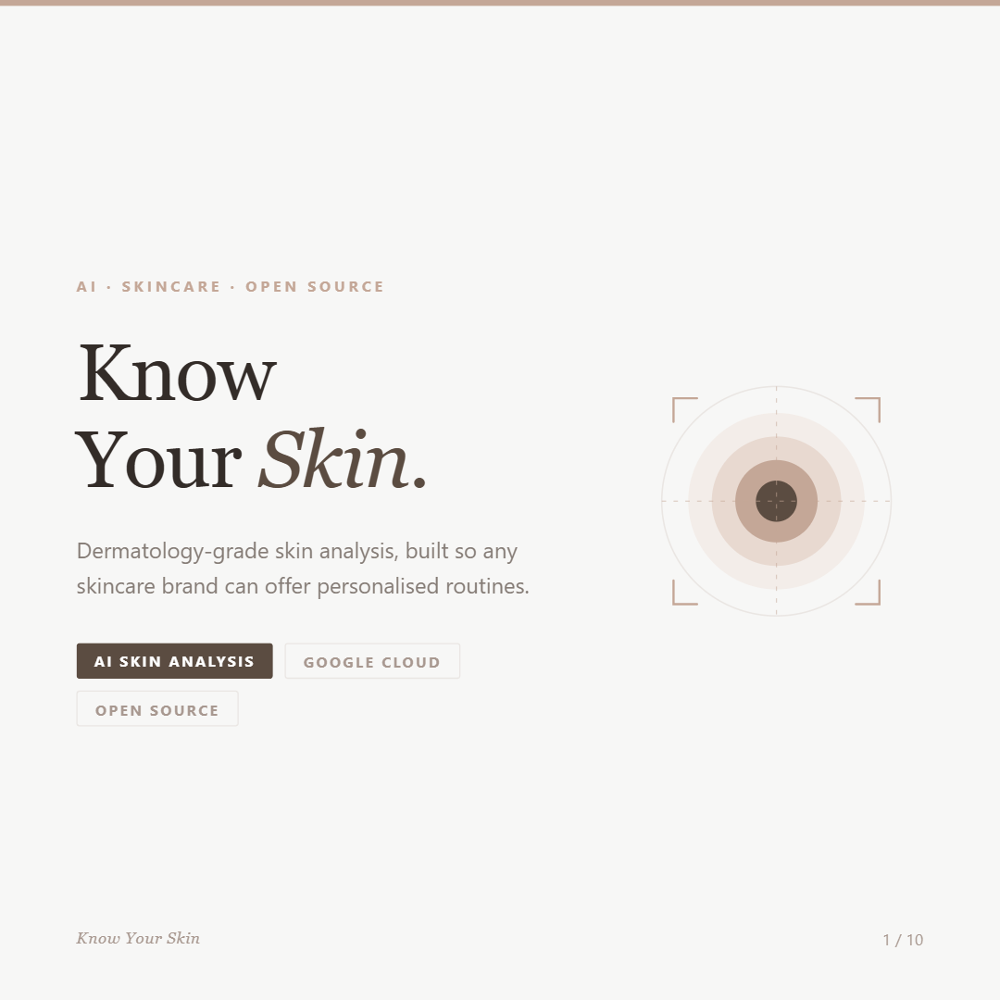
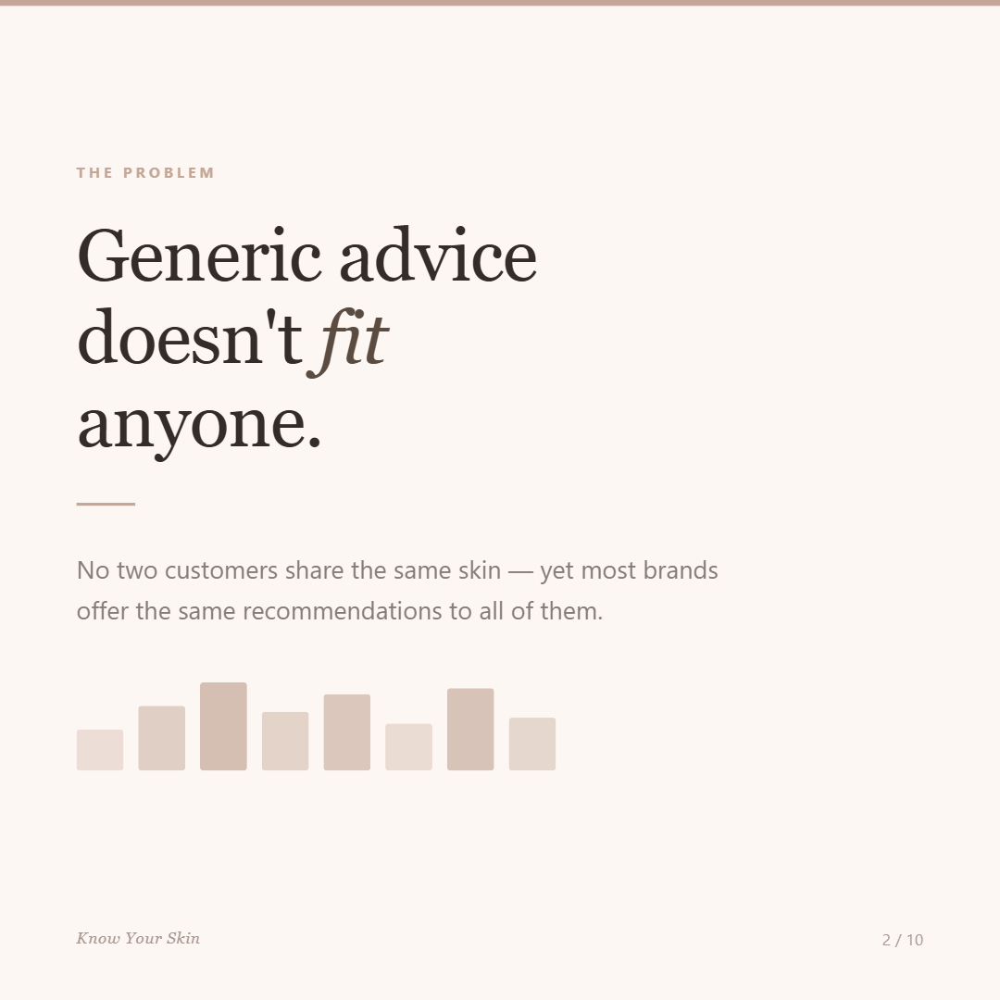
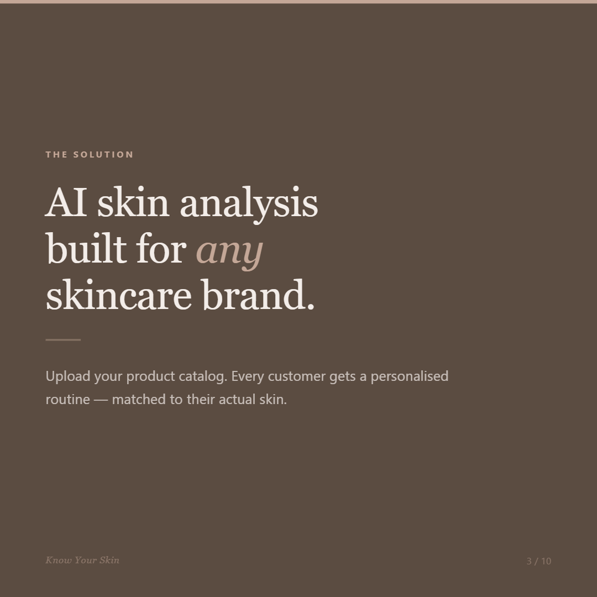
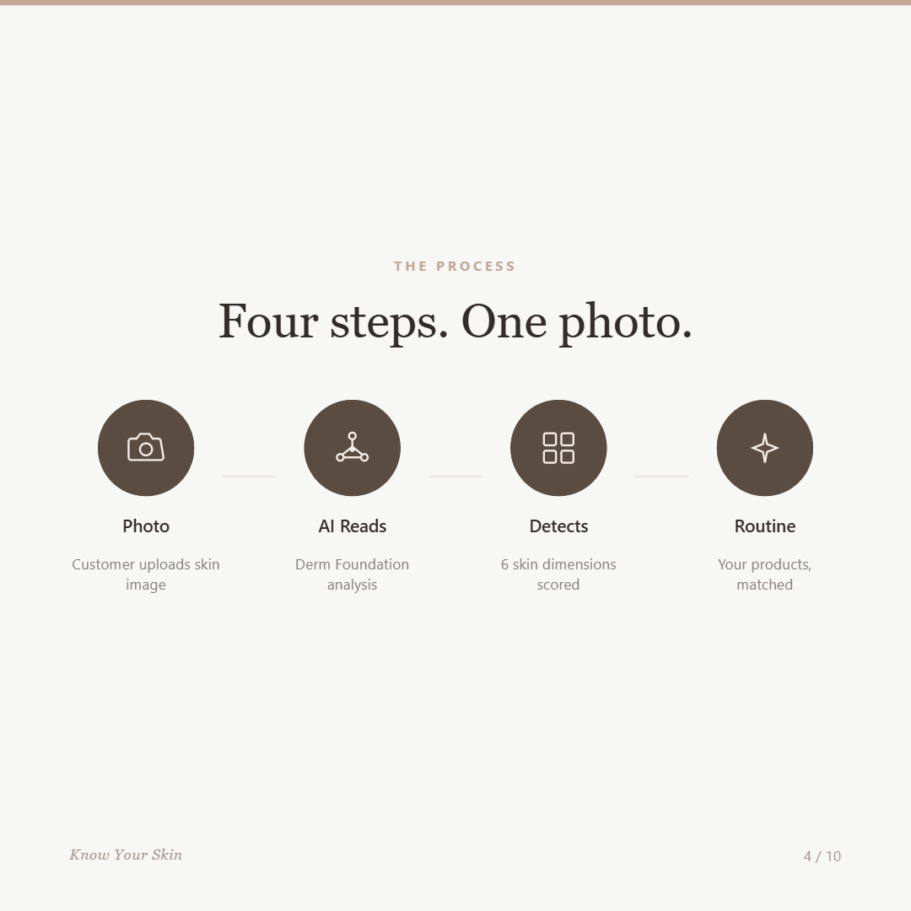
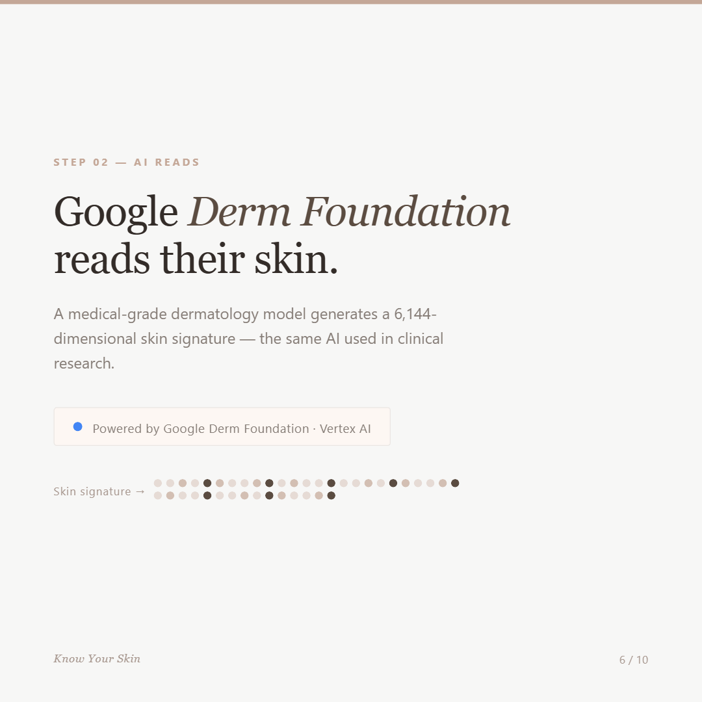
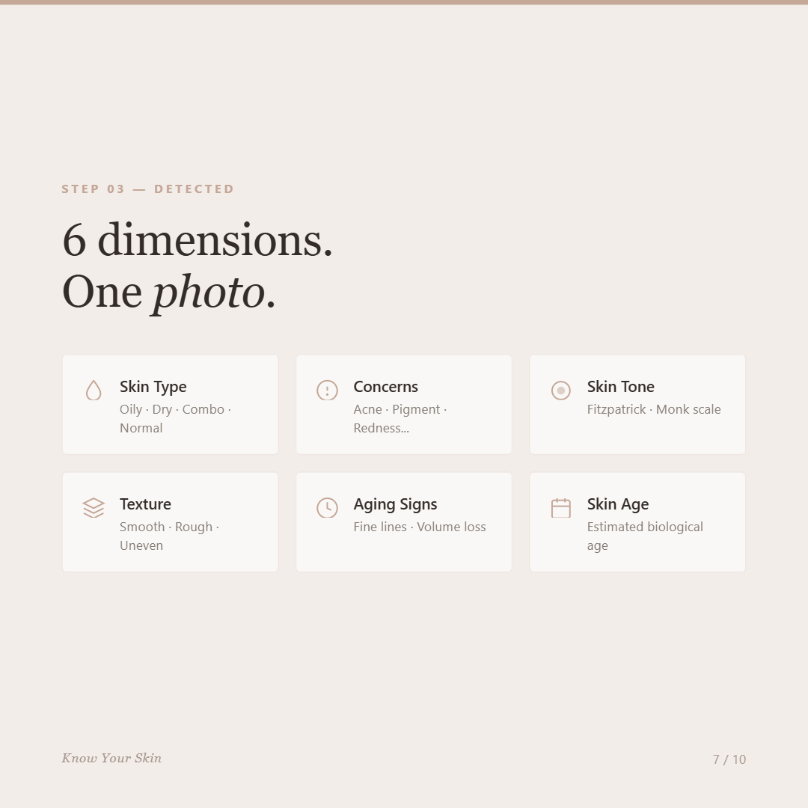
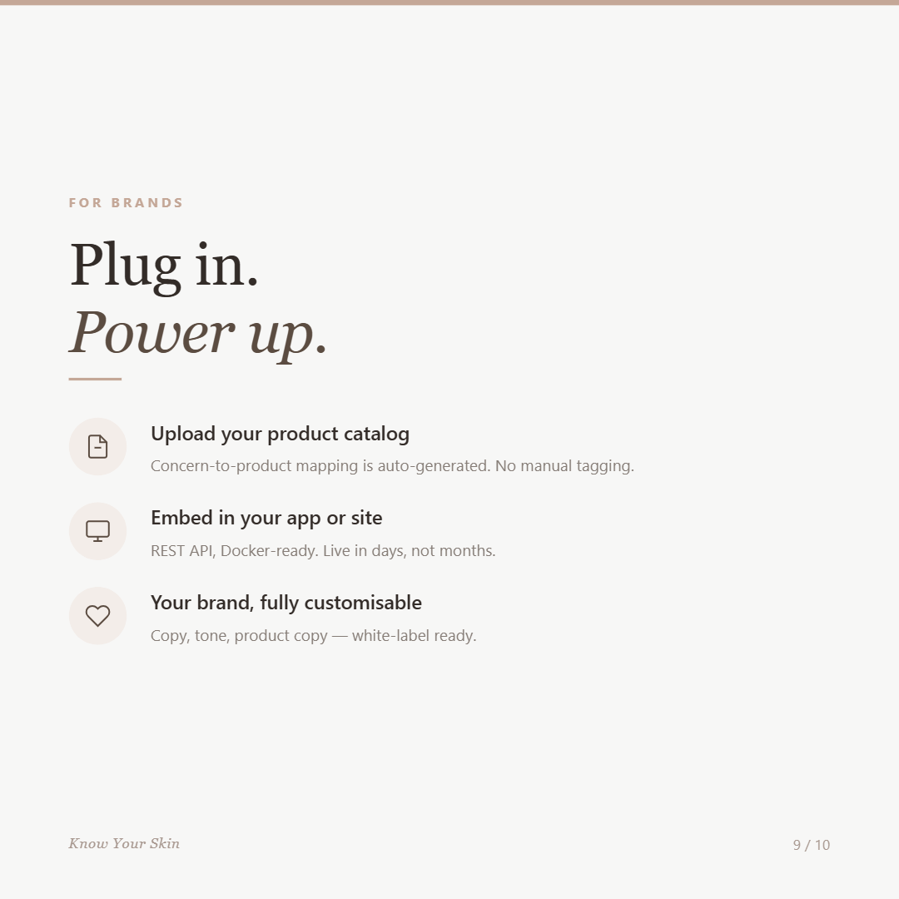

# Know Your Skin

> AI-powered skin analysis infrastructure for skincare brands.

[](LICENSE)
[](https://www.python.org/)
[](https://fastapi.tiangolo.com/)
[](https://cloud.google.com/vertex-ai)

A customer uploads a skin photo. The API returns a personalised skincare routine built from **your brand's own product catalog** — powered by Google's Derm Foundation model and custom classifiers trained on dermatology datasets.

---

## Demo

▶️ **[Watch the full demo](https://drive.google.com/file/d/1u-uuv5bovMTInwupGNB9PqquBIQdhs4P/view?usp=sharing)** — from uploading a photo to receiving a personalised routine.

---

## How it works

```
Customer photo
      │
      ▼
┌─────────────────────────────────────┐
│  Google Derm Foundation (Vertex AI) │  ← medical-grade skin embedding (6,144-dim)
└─────────────────────────────────────┘
      │
      ▼
┌─────────────────────────────────────┐
│  Custom Classifiers (local, CPU)    │
│  · Skin concerns  (PyTorch MLP)     │
│  · Skin type      (MLP)             │
│  · Skin tone      (Fitzpatrick +    │
│                    Monk scale)      │
│  · Texture        (logistic reg.)   │
│  · Aging signs    (MLP)             │
│  · Biological age (OpenCV/Caffe)    │
└─────────────────────────────────────┘
      │
      ▼
┌─────────────────────────────────────┐
│  Brand Catalog Matching             │  ← your products, your copy
│  (brand_products.py)                │
└─────────────────────────────────────┘
      │
      ▼
  Personalised routine JSON
  (cleanser → treatment → moisturiser → SPF)
```

Multi-image sessions are supported: the system averages embeddings across all uploaded photos for higher accuracy.

---

## Product overview

| | | | | |
|---|---|---|---|---|
|  |  |  |  |  |
|  |  |  |  |  |

---

## API endpoints

| Endpoint | Description |
|---|---|
| `POST /analyze` | Single image — cosmetic attributes + concerns + routine |
| `POST /analyze_session` | Multi-image session — averaged for higher accuracy |
| `POST /analyze_v2` | Cascaded: top-10 condition MLP → concerns → routine |
| `POST /analyze_v2_session` | Multi-image V2 session |
| `POST /deep_analysis` | Per-condition probability breakdown |
| `POST /get_skin_profile` | Cosmetic attributes only (tone, type, texture) |
| `POST /get_skin_type` | 4-class skin type classification |
| `POST /get_skin_age` | Estimated biological age + aging signs |
| `GET  /health` | Health check |

Full interactive docs available at `http://localhost:8000/docs` once running.

---

## Tech stack

| Layer | Technology |
|---|---|
| API | FastAPI · Uvicorn |
| ML inference | PyTorch (CPU) · scikit-learn · joblib |
| Embeddings | Google Derm Foundation via Vertex AI (Private Service Connect) |
| Image processing | Pillow · OpenCV (headless) |
| Age estimation | OpenCV DNN + Caffe model |
| Containerisation | Docker · docker-compose |
| Runtime | Python 3.11 |

---

## Plugging in your brand

**Know Your Skin is brand-agnostic by design.** The only file you need to edit is:

```
app/config/brand_products.py
```

Each product entry looks like this:

```python
"your_product_id": {
    "id":                 "your_product_id",
    "name":               "Your Product Name",
    "step":               "cleanser",          # cleanser | treatment | moisturizer | sunscreen | other
    "supported_concerns": ["Dry_Sensitive"],    # tags from config/concerns.py
    "portfolio":          "Hydration",          # optional grouping
    "why_template":       "Because {name}...", # optional explanation shown to users
    "image_name":         "product.png",        # optional, relative to your image dir
},
```

Available concern tags are defined in `app/config/concerns.py`. No retraining is required — the concern-to-product mapping is purely configuration.

---

## Setup

### Prerequisites

- Docker + Docker Compose
- A Google Cloud project with the **Derm Foundation** model deployed on **Vertex AI**
- A VM or service with a **Private Service Connect (PSC)** internal IP pointing to the Vertex endpoint

> The Derm Foundation model is available via [Google Cloud Healthcare AI](https://cloud.google.com/healthcare-ai). See the [Vertex AI documentation](https://cloud.google.com/vertex-ai/docs) for deployment instructions.

### 1. Configure environment

```bash
cp env.example .env
# Edit .env and fill in your Vertex AI values
```

### 2. Train the classifiers

The custom classifiers are not included in this repo (they are trained on the [SCIN dataset](https://github.com/google-research-datasets/scin) and require a Vertex AI project to generate embeddings). Training scripts are in `scripts/`:

```bash
# Download SCIN dataset
python scripts/download_scin_data.py

# Generate Derm Foundation embeddings (requires .env configured)
python scripts/generate_embeddings.py

# Train classifiers
python scripts/train_top10_mlp.py
python scripts/train_skintype.py
python scripts/train_aging.py
python scripts/train_texture.py
```

Trained `.joblib` artifacts should be placed in:

```
app/models/
├── scin_concerns_scaler.joblib
├── scin_concerns_logreg.joblib
├── scin_conditions_scaler.joblib
├── scin_conditions_logreg.joblib
├── top10_mlp_config.json
├── top10_mlp.joblib
├── cosmetic/
│   ├── fitzpatrick_*.joblib
│   ├── monk_*.joblib
│   └── texture_*.joblib
├── skintype/
│   └── skintype_*.joblib
└── aging/
    └── aging_*.joblib
```

### 3. Run

```bash
docker-compose up --build
```

The API is available at `http://localhost:8000`. Interactive docs at `http://localhost:8000/docs`.

### 4. Test

```bash
curl -X POST http://localhost:8000/analyze \
  -F "image=@your_photo.jpg" | python -m json.tool
```

---

## Project structure

```
know-your-skin/
├── app/
│   ├── api/
│   │   └── server.py           # FastAPI routes
│   ├── config/
│   │   ├── brand_products.py   # ← customise this for your brand
│   │   ├── concerns.py         # concern tag definitions
│   │   ├── cosmetic_copy.py    # educational copy
│   │   ├── top10_concerns.py   # V2 concern config
│   │   └── scin_conditions.py  # condition label list
│   ├── lib/
│   │   ├── derm_local.py       # Vertex AI embedding call
│   │   ├── full_analysis.py    # orchestration
│   │   ├── cascaded_inference.py
│   │   ├── concern_inference.py
│   │   ├── cosmetic_inference.py
│   │   ├── cosmetic_reporting.py
│   │   ├── recommendations.py
│   │   ├── reporting.py
│   │   ├── session_aggregation.py
│   │   ├── skintype_inference.py
│   │   ├── aging_inference.py
│   │   └── deepface_inference.py
│   └── models/                 # trained artifacts (not committed)
├── scripts/                    # data download + training utilities
├── docs/
│   └── carousel/               # product overview slides
├── linkedin-carousel/
│   └── carousel.html           # interactive slide viewer
├── Dockerfile
├── docker-compose.yml
├── env.example
├── requirements.txt
└── README.md
```

---

## Contributing

See [CONTRIBUTING.md](CONTRIBUTING.md).

## License

[MIT](LICENSE) — free to use, modify, and build on. Attribution appreciated.

---

*Built with Google Derm Foundation · FastAPI · PyTorch · Open Source*
